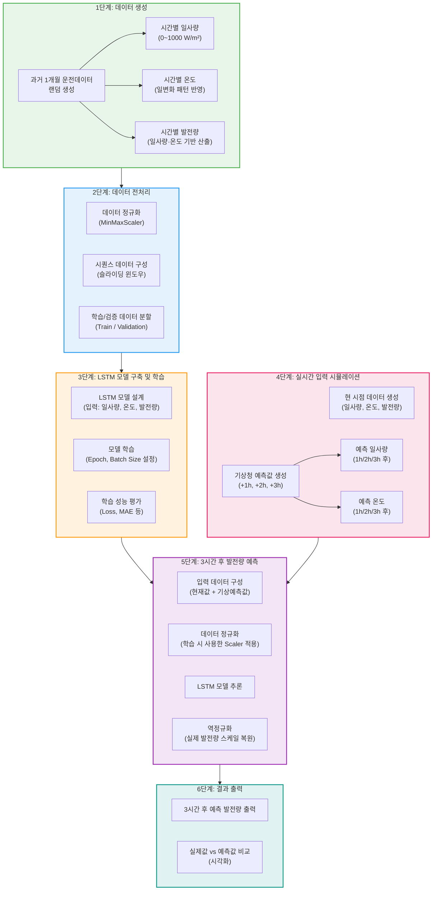

소규모 태양광발전단지에서 과거 한달 동안의 운전데이터(일사량, 온도 및 발전량)이 확보된 상태에서 현 시점의 일사량, 온도 및 발전량을 기반으로 기상청으로부터 지금으로부터 1시간 간격으로 3시간후의 예측된 일사량, 온도값을 사용하여 3시간후의 발전량을 예측하는 알고리즘을 구현하고자 함. 그런데 예측알고리즘은 lstm을 사용하고 실제 한달 동안의 운전데이터의 확보가 어려운 관계로 시간에 따른 합리적인 일사량, 온도 및 발전량을 랜덤으로 발생시키고 현 시점의 일사량, 온도 및 발전량과 기상청으로부터의 3시간 예측값도 랜덤으로 발생시켜서 3시간 후의 발전량을 예측하려고 함. 코드는 파이선으로 작업하려고 함

---

## 프로젝트 실행 블록도

